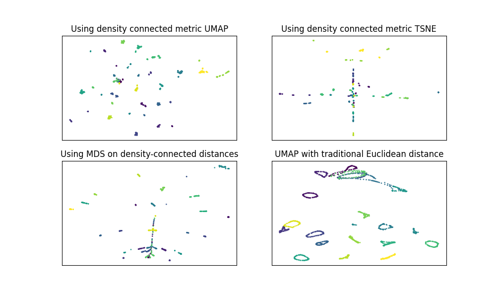

# Density-Connected Dimensionality Reduction

The `sandbox.py` file defaults to running our density-connected dimensionality reduction on the first 20 classes of the
coil-100 dataset with UMAP, TSNE, and PCA. It works by providing the density-connected nearest-neighbor algorithm as input to
the [GDR algorithm](github.com/Andrew-Draganov/GiDR-DUN), which then runs UMAP and TSNE on the nearest neighbors graph.
We then also perform PCA by doing multi-dimensional scaling on the full density-connected distance matrix. These
are plotted alongside the traditional UMAP output on the same 20 classes of coil-100.

Example image below:

To run it, simply clone the repo and, in a virtual environment, call `pip install -e .` from the base directory.

You will have to download the coil-100 dataset from [here](https://www.kaggle.com/datasets/jessicali9530/coil100) and unpack it
into the path `data/coil-100`.

Feel free to email me if you have any questions -- anonymous
